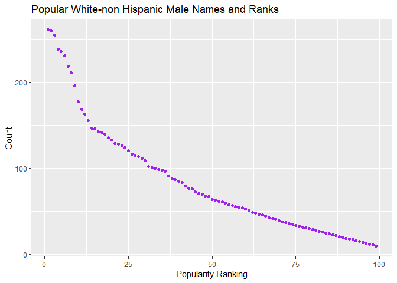

Homework \#2
================
Harsha Senapathi
10/3/2019

# Loading Library

``` r
library(tidyverse)
```

    ## -- Attaching packages -------------------------------------------------------------------------- tidyverse 1.2.1 --

    ## v ggplot2 3.2.1     v purrr   0.3.2
    ## v tibble  2.1.3     v dplyr   0.8.3
    ## v tidyr   1.0.0     v stringr 1.4.0
    ## v readr   1.3.1     v forcats 0.4.0

    ## -- Conflicts ----------------------------------------------------------------------------- tidyverse_conflicts() --
    ## x dplyr::filter() masks stats::filter()
    ## x dplyr::lag()    masks stats::lag()

``` r
library(tidyr)
library(readxl)
```

# Problem 1

The import and manipulation of the Mr. Trash Wheel
Dataset.

``` r
trashwheel = read_excel("./data/Trash-Wheel-Collection-Totals-8-6-19.xlsx",
                        sheet = 1, 
                        range = "A2:N408") %>% 
  janitor::clean_names() %>%
  select(-dumpster) %>%
  mutate(sports_balls = as.integer(round(sports_balls))) %>% 
  rename("weight" = weight_tons, "volume" = volume_cubic_yards) #renaming columns to more reasonable variable names
```

The columns weight\_tons and volume\_cubic\_yards were renamed to weight
and volume since mentioning units seems superfluous. It can be mentioned
once in the data description to suffice for it.

Import and manipulation of the precipitation data from 2017 and 2018

## Precipitation Dataset

The following code trunk reads and cleans precipitation data for 2017
and 2018. For each, omit rows without precipitation data and add a
variable year. Next, combine datasets and convert month to a character
variable.

``` r
data_prcpttn_2017 = 
    read_excel("./data/Trash-Wheel-Collection-Totals-8-6-19.xlsx", sheet = '2017 Precipitation', range = "A2:B14") %>%
    janitor::clean_names() %>% 
    drop_na(total) %>% #delete rows without precipitation data
    mutate(year = 2017)
    
data_prcpttn_2018 = 
    read_excel("./data/Trash-Wheel-Collection-Totals-8-6-19.xlsx", sheet = '2018 Precipitation', range = "A2:B14") %>%
    janitor::clean_names() %>% 
    drop_na(total) %>% #delete rows without precipitation data
    mutate(year = 2018)

# Combine datasets for years 2017 and 2018

prcpttn = bind_rows(data_prcpttn_2017, data_prcpttn_2018) %>% 
    mutate(month = month.name[month]) %>% 
    select(year, month, total)

# Check the combined dataset
head(prcpttn)
```

    ## # A tibble: 6 x 3
    ##    year month    total
    ##   <dbl> <chr>    <dbl>
    ## 1  2017 January   2.34
    ## 2  2017 February  1.46
    ## 3  2017 March     3.57
    ## 4  2017 April     3.99
    ## 5  2017 May       5.64
    ## 6  2017 June      1.4

``` r
tail(prcpttn)
```

    ## # A tibble: 6 x 3
    ##    year month     total
    ##   <dbl> <chr>     <dbl>
    ## 1  2018 July      10.2 
    ## 2  2018 August     6.45
    ## 3  2018 September 10.5 
    ## 4  2018 October    2.12
    ## 5  2018 November   7.82
    ## 6  2018 December   6.11

## Interpretation

There are 406 observations and 13 variables in the Mr. Trash Wheel
dataset, and 24 observations and 3 variables in the precipitation
dataset. Key variables in the Mr. Trash Wheel dataset include
`weight_tons`, number of different items (such as `sports_balls`) and
`homes_powered`. For the precipitation dataset, the key variable is
`total`, which denotes the volume of precipitation for each month. The
total precipitation in 2017 was 32.93. The median number of sports balls
in a dumpster in 2018 was 4.

# Problem 2

``` r
#cleaning polls dataset
polls = read_csv(file = "./data/fivethirtyeight_datasets/pols-month.csv")%>%
  separate(mon, c("year", "month", "day"), 
           convert = TRUE)%>%
  mutate (month = month.name[month])%>%
  mutate(prez_dem = recode (prez_dem, '1' = "dem")) %>% 
  mutate(prez_gop = recode (prez_gop, '1' = "gop", '2' = "gop")) %>% 
  pivot_longer(
    cols = c("prez_dem", "prez_gop"), 
    values_to = "president", 
    values_drop_na = TRUE
  ) %>% 
  select(-day, -name)
```

    ## Parsed with column specification:
    ## cols(
    ##   mon = col_date(format = ""),
    ##   prez_gop = col_double(),
    ##   gov_gop = col_double(),
    ##   sen_gop = col_double(),
    ##   rep_gop = col_double(),
    ##   prez_dem = col_double(),
    ##   gov_dem = col_double(),
    ##   sen_dem = col_double(),
    ##   rep_dem = col_double()
    ## )

    ## Warning: Unreplaced values treated as NA as .x is not compatible. Please
    ## specify replacements exhaustively or supply .default
    
    ## Warning: Unreplaced values treated as NA as .x is not compatible. Please
    ## specify replacements exhaustively or supply .default

``` r
#cleaning snp dataset
snp = read_csv(file = "./data/fivethirtyeight_datasets/snp.csv")%>%
    separate(date, c("year", "month", "day"), 
             convert = TRUE)%>%
   mutate (month = month.name[month])%>%
  select(year, month, -day, everything())
```

    ## Parsed with column specification:
    ## cols(
    ##   date = col_character(),
    ##   close = col_double()
    ## )

``` r
#cleaning and transforming unemployment data
unemployment = read_csv("./Data/fivethirtyeight_datasets/unemployment.csv") %>%
  pivot_longer(Jan:Dec, 
    names_to = "month",
    values_to = "rate"
  ) %>% 
  mutate(month = match(month, month.abb)) %>%
  mutate(month = month.name[month]) %>%
  mutate(Year = as.integer(Year)) %>%
  janitor::clean_names()
```

    ## Parsed with column specification:
    ## cols(
    ##   Year = col_double(),
    ##   Jan = col_double(),
    ##   Feb = col_double(),
    ##   Mar = col_double(),
    ##   Apr = col_double(),
    ##   May = col_double(),
    ##   Jun = col_double(),
    ##   Jul = col_double(),
    ##   Aug = col_double(),
    ##   Sep = col_double(),
    ##   Oct = col_double(),
    ##   Nov = col_double(),
    ##   Dec = col_double()
    ## )

``` r
#combining data sets, to create a dataset with polls, snp and unemployent rate.
Final = polls%>%
  left_join( snp,
             by = c("year", "month"))%>%
  left_join( unemployment,
             by = c("year", "month"))
```

## Interpretation

There are 822, 787, 816, 822 observations and 9, 4, 3, 12 in the Polls
per month dataset, snp data set, unemployment dataset and the final
merged dataset respectively. The final dataset includes some key
variables like year, month, gov\_gop, sen\_gop, rep\_gop, gov\_dem,
sen\_dem, rep\_dem, president, day, close, rate. The range of years 1947
to 2015

# Problem 3:

We are trying to analyze a datasite with popular baby names among males
and females.

``` r
pop_names = read_csv(file="./data/popular_Baby_Names.csv")%>%
  janitor::clean_names()%>%
  mutate(ethnicity = recode(ethnicity, "ASIAN AND PACI" = "ASIAN AND PACIFIC ISLANDER", "BLACK NON HISP" = "BLACK NON HISPANIC", "WHITE NON HISP" = "WHITE NON HISPANIC"))%>%
  mutate(childs_first_name = str_to_lower(childs_first_name))%>%
  distinct()
```

    ## Parsed with column specification:
    ## cols(
    ##   `Year of Birth` = col_double(),
    ##   Gender = col_character(),
    ##   Ethnicity = col_character(),
    ##   `Child's First Name` = col_character(),
    ##   Count = col_double(),
    ##   Rank = col_double()
    ## )

``` r
pop_names %>%
  filter(childs_first_name == "olivia")%>%
  select(-count)%>%
  pivot_wider(
    names_from = "year_of_birth",
    values_from = "rank")
```

    ## # A tibble: 4 x 9
    ##   gender ethnicity childs_first_na~ `2016` `2015` `2014` `2013` `2012`
    ##   <chr>  <chr>     <chr>             <dbl>  <dbl>  <dbl>  <dbl>  <dbl>
    ## 1 FEMALE ASIAN AN~ olivia                1      1      1      3      3
    ## 2 FEMALE BLACK NO~ olivia                8      4      8      6      8
    ## 3 FEMALE HISPANIC  olivia               13     16     16     22     22
    ## 4 FEMALE WHITE NO~ olivia                1      1      1      1      4
    ## # ... with 1 more variable: `2011` <dbl>

``` r
pop_names %>%
  filter(gender == "male")%>%
  filter(rank == 1)%>%
  select(-count)%>%
  pivot_wider(
    names_from = "year_of_birth",
    values_from = "childs_first_name"
  )
```

    ## # A tibble: 0 x 4
    ## # ... with 4 variables: gender <chr>, ethnicity <chr>,
    ## #   childs_first_name <chr>, rank <dbl>

## Creating a plot matching the rank and count of popular white non-hispanic male names

``` r
pop_names %>%
  #filtering male and white non hispanic children names from the year 2016
  filter(gender == "MALE",
         ethnicity == "WHITE NON HISPANIC",
         year_of_birth == 2016)%>%
  #creating ggplot
  ggplot(aes(x=rank, y=count)) + 
  geom_point(colour = "purple") +
  labs(
    title = "Popular White-non Hispanic Male Names and Ranks ",
    x = "Popularity Ranking",
    y = "Count"
  )
```

<!-- -->
